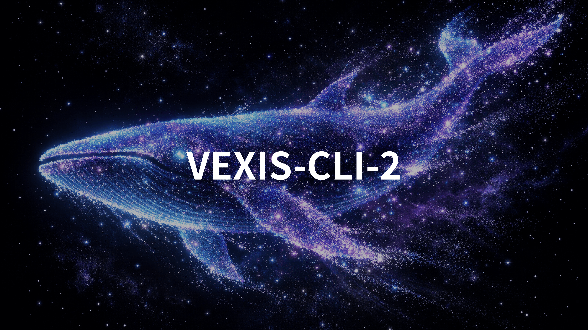
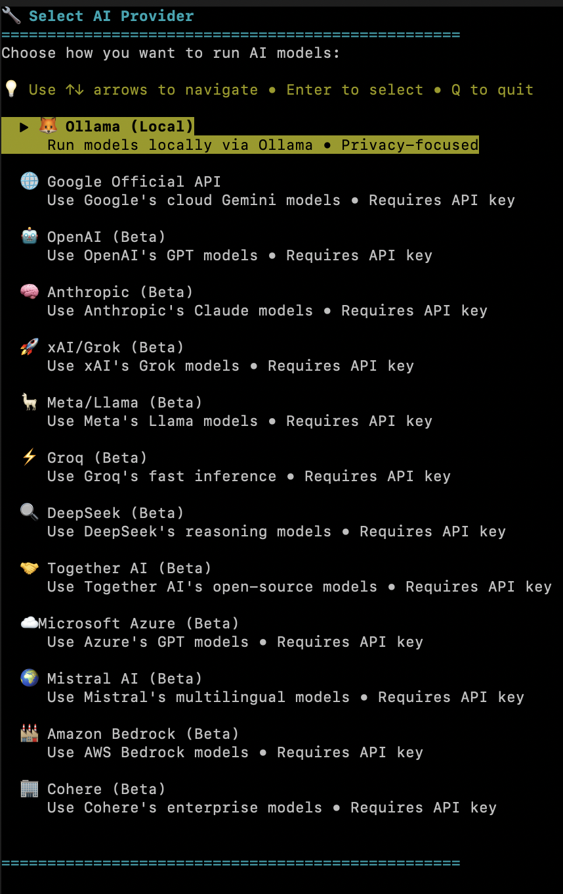
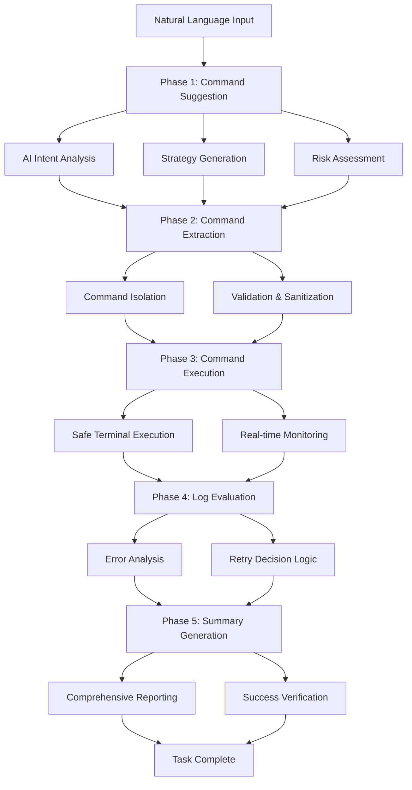

<div align="center">

# VEXIS-CLI



[](https://www.python.org/)
[](LICENSE)
[]()
[](#ai-providers)

**🧠 Advanced 5-Phase AI-powered terminal automation system**

*Transform natural language into precise terminal commands with intelligent multi-phase processing*

---

[🚀 Quick Start](#installation) • [📖 Documentation](#documentation) • [🎯 Features](#features) • [⚙️ Configuration](#configuration) • [🤝 Contributing](#contributing)

</div>

---

## ✨ Why VEXIS-CLI?

**VEXIS-CLI** represents a quantum leap in command-line automation, featuring a sophisticated **5-Phase Pipeline Architecture** that delivers unprecedented accuracy and reliability in natural language to command translation.

🎯 **"Create a backup of my documents folder"** → Intelligent backup with verification  
🎯 **"Find all Python files with syntax errors"** → Multi-stage code analysis with reporting  
🎯 **"Set up a development environment for React"** → Complete environment setup with validation  

---

## 🌟 Revolutionary Features

### 🧠 **5-Phase Pipeline Architecture**
- **Phase 1**: Command Suggestion - AI analyzes intent and suggests approach
- **Phase 2**: Command Extraction - Precise command isolation and validation  
- **Phase 3**: Command Execution - Safe terminal execution with monitoring
- **Phase 4**: Log Evaluation - Intelligent error analysis and retry logic
- **Phase 5**: Summary Generation - Comprehensive result reporting

### ⚡ **Advanced Execution Engine**
- Multi-iteration error recovery with self-correction
- Real-time progress tracking and status updates
- Intelligent fallback mechanisms across providers
- Comprehensive safety validation and rollback capabilities

### 🔗 **Universal AI Provider Ecosystem**
- **16+ AI providers** with unified interface abstraction
- Automatic provider selection based on task requirements
- Seamless fallback and load balancing across providers
- Vision API support for image-based tasks

### 🛡️ **Enterprise-Grade Architecture**
- Zero-defect configuration management with validation
- Comprehensive logging with structured output
- Platform abstraction for cross-platform compatibility
- Advanced error handling with detailed diagnostics

### 🎨 **Modern User Experience**
- Rich terminal interface with syntax highlighting
- Interactive provider selection with performance metrics
- Real-time execution monitoring and feedback
- Comprehensive documentation and examples

---

## 🤖 AI Provider Ecosystem

### 🏠 **Local & Privacy-First**
<div align="center">

**🦙 Ollama** - Complete local AI integration  
*Recommended 2026 models: `llama-4-scout-17b`, `deepseek-r1`, `qwen2.5:7b`*

</div>

### ☁️ **2026 Cloud Powerhouses**
<div align="center">

| Provider | 2026 Models | Speed | Specialty |
|----------|-------------|-------|-----------|
| 🚀 **Groq** | Llama 3.3 70B, GPT-OSS 120B | ⚡⚡⚡⚡⚡ | Ultra-fast inference |
| 🔮 **Google** | Gemini 3.1 Pro, Gemini 3 Flash | ⚡⚡⚡⚡ | Enterprise reliability |
| 🧠 **OpenAI** | GPT-5.4, GPT-5.4-pro, GPT-5-mini | ⚡⚡⚡⚡ | Advanced reasoning |
| 🎭 **Anthropic** | Claude Opus 4.6, Claude Sonnet 4.5 | ⚡⚡⚡⚡ | Analytical excellence |
| ⚡ **xAI** | Grok 4.20, Grok 4.20-beta | ⚡⚡⚡⚡ | Real-time knowledge |
| 🦊 **Meta** | Llama 4 Scout 17B | ⚡⚡⚡ | Open-source leadership |
| 🌊 **Mistral** | Latest multilingual models | ⚡⚡⚡ | Global applications |
| 🔷 **Microsoft** | GPT-5.4-pro via Azure | ⚡⚡⚡ | Enterprise integration |
| 🏔️ **AWS** | Claude Opus 4.6 via Bedrock | ⚡⚡⚡ | Scalable infrastructure |
| 🎯 **Cohere** | Latest business models | ⚡⚡⚡ | Enterprise workflows |
| 🔍 **DeepSeek** | DeepSeek R1, DeepSeek V4 | ⚡⚡⚡ | Technical reasoning |
| 🤝 **Together** | Llama 4 hosting | ⚡⚡⚡ | Custom model deployment |
| 🎮 **MiniMax** | Latest generation models | ⚡⚡⚡ | Creative tasks |
| 🇨🇳 **Zhipu** | GLM latest models | ⚡⚡⚡ | Chinese language |

</div>

> 💡 **2026 Recommendations**: **Groq** (speed), **Google Gemini 3.1** (reliability), **OpenAI GPT-5.4** (capability), **Ollama Llama 4** (privacy)

---

## 🚀 Installation

### 🎯 **Zero-Configuration Quick Start**
```bash
git clone https://github.com/AInohogosya/VEXIS-CLI.git
cd VEXIS-CLI
python3 run.py "list files"  # Auto-setup and run!
```

### ✅ **System Requirements**
- **Python 3.8+** (wide compatibility)
- **4GB+ RAM** for local models (8GB+ recommended for Llama 4)
- **API keys** for cloud providers
- **Optional**: Ollama for local AI (`curl -fsSL https://ollama.ai/install.sh | sh`)
- **Tested on**: Ubuntu and macOS

> ⚠️ **Note**: Bugs may occur with certain models or providers. If you encounter issues, please try selecting a different model or provider. We will fix the issue as soon as the cause is identified.

### 🎨 **First Run Experience**
VEXIS-CLI features an enhanced provider selection interface with real-time performance metrics:



---

## 💻 Usage Examples

### 🏁 **5-Phase Pipeline in Action**
```bash
# Simple operations with intelligent validation
python3 run.py "create a comprehensive README for my project"
python3 run.py "find and organize files larger than 10MB by date"
python3 run.py "set up Python development environment with testing"

# Complex multi-step tasks
python3 run.py "analyze all Python files for security vulnerabilities"
python3 run.py "deploy this React application to production with monitoring"
python3 run.py "optimize system performance and generate detailed report"

# Advanced automation
python3 run.py "create automated backup system with encryption and verification"
python3 run.py "monitor system resources and alert on anomalies for 24 hours"
```

### 🎛️ **Advanced Configuration**
```bash
# Use specific provider with 5-phase pipeline
python3 run.py "complex task" --provider groq --model llama-3.3-70b-versatile

# Enable debug mode with detailed phase logging
python3 run.py "debug task" --debug --phase-logging

# Skip interactive prompts (uses configured preferences)
python3 run.py "quick automation" --no-prompt --auto-confirm

# Vision-enabled tasks
python3 run.py "analyze this screenshot and suggest improvements" --image screenshot.png
```

---

## ⚙️ Configuration

### 📝 **Advanced Configuration System**
VEXIS-CLI uses a hierarchical configuration system with validation:

```yaml
# API Configuration
api:
  preferred_provider: "groq"
  local_endpoint: "http://localhost:11434"
  local_model: "llama-4-scout-17b"
  timeout: 120
  max_retries: 3
  auto_fallback: true

# 5-Phase Engine Configuration
engine:
  command_timeout: 30
  task_timeout: 300
  max_iterations: 10
  enable_phase_logging: false
  auto_recovery: true

# User Preferences
user:
  name: "YOUR_NAME"
  preferred_style: "detailed"  # "concise", "detailed", "friendly"
  auto_confirm: false
  show_progress: true

# Logging Configuration
logging:
  level: "INFO"
  file: "vexis.log"
  json_format: false
  console: true
  max_file_size: 10485760  # 10MB
```

### 🎯 **2026 Model Recommendations**
- **🏠 Local**: `llama4-scout-17b` (balanced), `deepseek-r1` (reasoning), `qwen2.5:7b` (speed)
- **☁️ Cloud**: `gpt-5.4-pro` (professional), `gemini-3.1-pro` (enterprise), `claude-opus-4.6` (analytical)

---

## 🏗️ Advanced Architecture

### 🧠 **5-Phase Pipeline Engine**



### 🏛️ **Core Components**
- **🎯 FivePhaseEngine** - Advanced 5-phase pipeline orchestration
- **🤖 ModelRunner** - Unified 16+ provider abstraction with fallback
- **📝 CommandParser** - Enhanced NLP with context awareness
- **✅ TaskVerifier** - Multi-layer validation and security
- **🔄 TaskRobustnessManager** - Advanced error recovery and retry logic
- **📊 TerminalHistory** - Comprehensive execution tracking

---

## 🛠️ Development & Contributing

### 🤝 **Contributing to VEXIS-CLI**
We welcome contributions to our advanced AI automation platform:

1. **🐛 Bug Reports**: Use our detailed issue templates for precise reporting
2. **💡 Feature Requests**: Propose enhancements to the 5-phase pipeline
3. **🔧 Pull Requests**: Follow our strict code quality standards
4. **📖 Documentation**: Help maintain our comprehensive docs
5. **🧪 Testing**: Contribute to our extensive test coverage

### 🧪 **Advanced Testing Suite**
```bash
# Run comprehensive test suite
python3 -m pytest tests/ --cov=src

# Test 5-phase pipeline components
python3 test_five_phase_engine.py

# Test provider integrations
python3 test_cloud_models.py --all-providers

# System validation
python3 check_environment.py --full-validation
python3 system_check.py --performance-test
```

### 🔧 **Development Tools**
```bash
# Dependency management
python3 manage_sdks.py --install-all

# Model validation
python3 check_models.py --validate-2026-models

# Performance benchmarking
python3 test_improved_prompts.py --benchmark
```

---

## 📚 Comprehensive Documentation

| Document | Focus | Link |
|----------|-------|------|
| 📖 **Architecture Guide** | 5-Phase pipeline deep dive | [docs/ARCHITECTURE.md](./docs/ARCHITECTURE.md) |
| ⚙️ **Configuration Reference** | Complete configuration options | [docs/CONFIGURATION.md](./docs/CONFIGURATION.md) |
| 🔧 **API Reference** | Provider integration guide | [docs/API_REFERENCE.md](./docs/API_REFERENCE.md) |
| 🚀 **Deployment Guide** | Production deployment | [docs/DEPLOYMENT.md](./docs/DEPLOYMENT.md) |
| 🛠️ **Development Guide** | Contributing and development | [docs/DEVELOPMENT.md](./docs/DEVELOPMENT.md) |
| 🔍 **Troubleshooting** | Common issues and solutions | [docs/TROUBLESHOOTING.md](./docs/TROUBLESHOOTING.md) |
| 🦙 **Ollama Integration** | Local AI setup and optimization | [docs/OLLAMA_INTEGRATION.md](./docs/OLLAMA_INTEGRATION.md) |
| ⚡ **Error Handling** | Advanced error management | [docs/ERROR_HANDLING.md](./docs/ERROR_HANDLING.md) |

---

## 🏆 Community & Enterprise Support

### 💬 **Get Help**
- 📖 [Comprehensive Documentation](./docs/)
- 🐛 [Advanced Issues: GitHub Issues](https://github.com/AInohogosya/VEXIS-CLI/issues)
- 💬 [Community Discussions](https://github.com/AInohogosya/VEXIS-CLI/discussions)
- 🏢 [Enterprise Support](mailto:AInohogosya@proton.me)

### ⭐ **Show Your Support**
- **⭐ Star the repository** - Help others discover VEXIS-CLI
- **🔄 Fork and contribute** - Build on our 5-phase architecture
- **📝 Share your use cases** - Inspire the community with innovative applications

---

<div align="center">

## 🎉 Experience the Future of Terminal Automation

**VEXIS-CLI: Where advanced AI meets precise command execution**

[🚀 Get Started Now](#installation) • [⭐ Star on GitHub](https://github.com/AInohogosya/VEXIS-CLI) • [📖 Explore Documentation](./docs/) • [🏢 Enterprise Support](mailto:AInohogosya@proton.me)

---

### Built with ❤️ by the VEXIS Project

*Pushing the boundaries of AI-powered automation*

---


</div>
